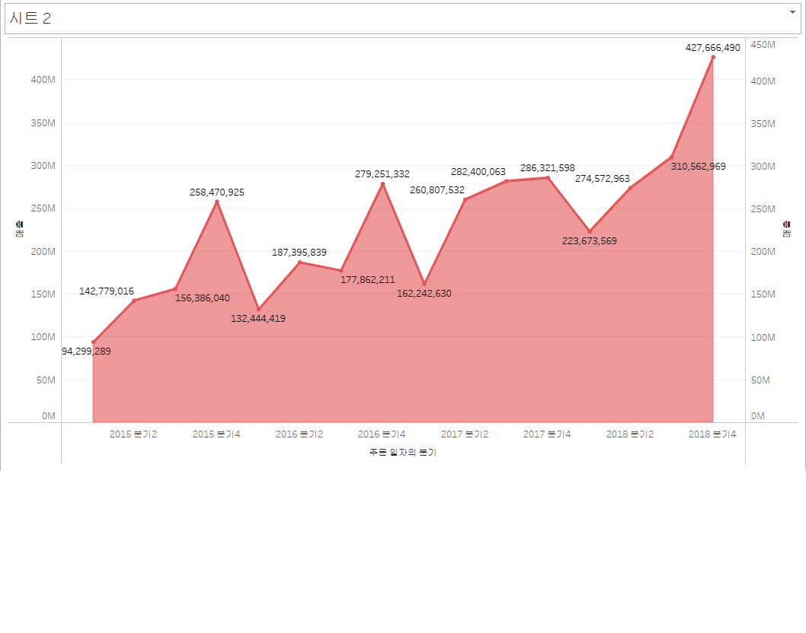

# 1. 고객별 재구매 시기 데이터 분석 태블로 시각화

이 그래프는 고객별 두 번째 구매까지 걸린 날짜(구간 단위)와 고객들의 교차 카운트를 나타냅니다. 각 막대는 특정 구간에 해당하는 고객 수를 보여주며, 높이가 높을수록 그 구간에 해당하는 고객의 재구매 비율이 높은 것을 의미합니다. 

예를 들어, 그래프에서 100일 구간에 해당하는 막대는 고객들이 두 번째 구매까지 걸린 평균 기간이 100일임을 나타내며, 교차 카운트는 25명입니다.

# 2. 고객 세그먼트별 연간 매출액 추이 그래프

이 그래프는 연간 매출액 추이 그래프를 나타냅니다.

# 3. 고객 세그먼트별 연간 매출액 누적 막대 그래프

이 그래프는 세그먼트별 연간 매출액을 누적 막대그래프로 나타냅니다.

# 4. 분기별 매출액 영역 차트

이 그래프는 주문 일자의 분기별 매출액을 영역 차트로 나타냅니다.

# 5. 연도별 매출액 비교 라인 그래프

이 그래프는 월별 주문 일자의 매출액 변화를 연도별로 나타냅니다.

# 6. 라운드형 막대 그래프

이 그래프는 지역별 매출액 변화를 나타냅니다.

# 7. 연도별 매출액 비교 라인 그래프

  
이 그래프는 연도별 주문 일자의 매출액 변화를 월별로 나타내고, 평균 영역을 보여줍니다.

# 8.채워진 맵

이 지도는 생활권역 별 수익을 시각화해서 보여줍니다.

# 9. 기호맵맵

이 지도는 시군구별 수량 수익을 대한민국 지도로 시각화해서 보여줍니다.
